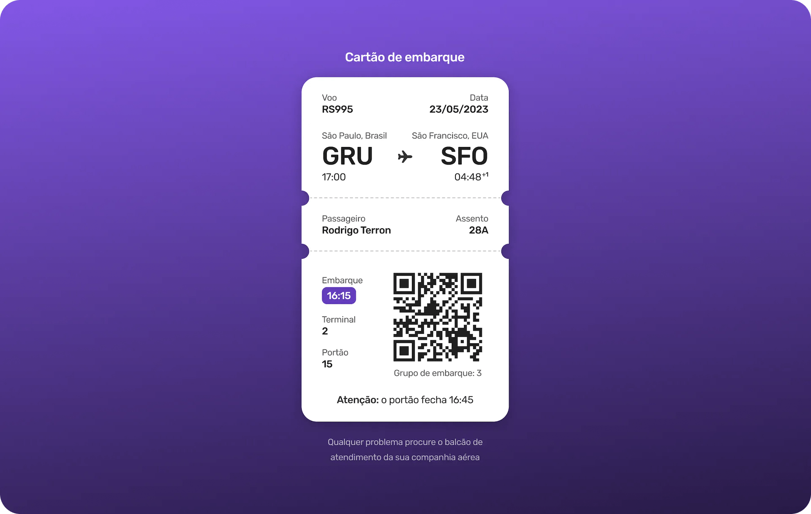

# Cartão de Embarque

## 💻 Sobre

Página estática responsiva de um cartão de embarque desenvolvido durante o evento da Rocketseat

## 🔖 Layout

Você pode visualizar o layout do projeto no Figma através [DESSE LINK](https://www.figma.com/community/file/1205146101173113980).

## Outros

Esse projeto foi desenvolvido com as seguintes tecnologias:

- HTML e CSS
- JavaScript
- Git e Github
